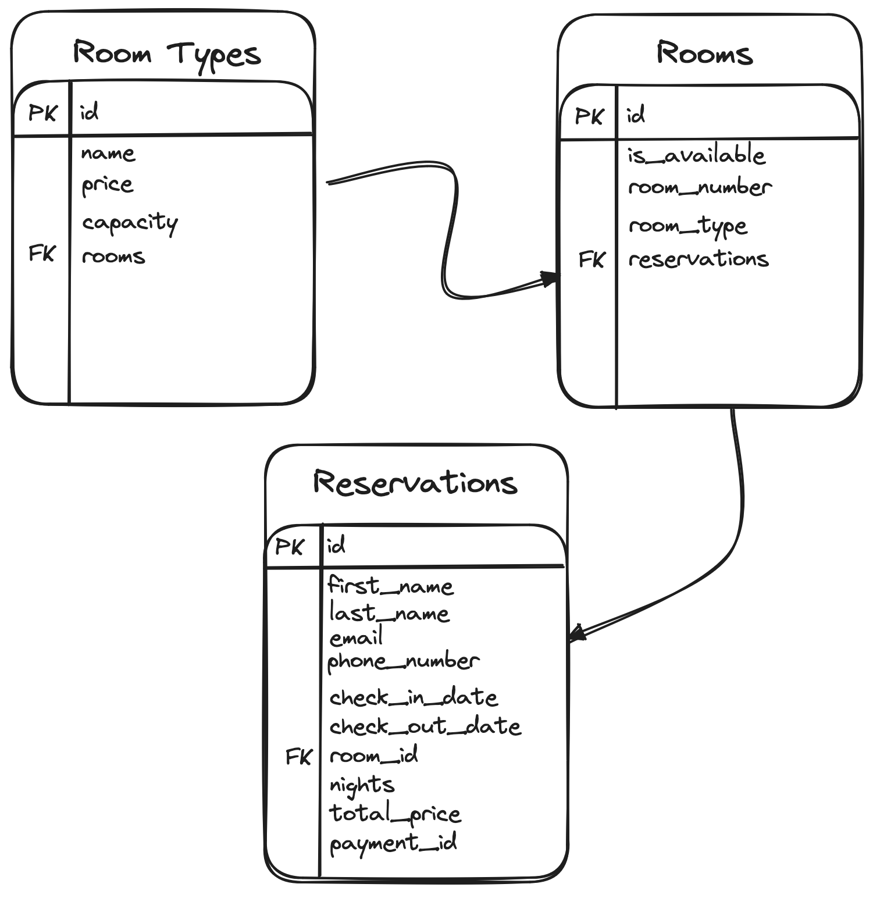
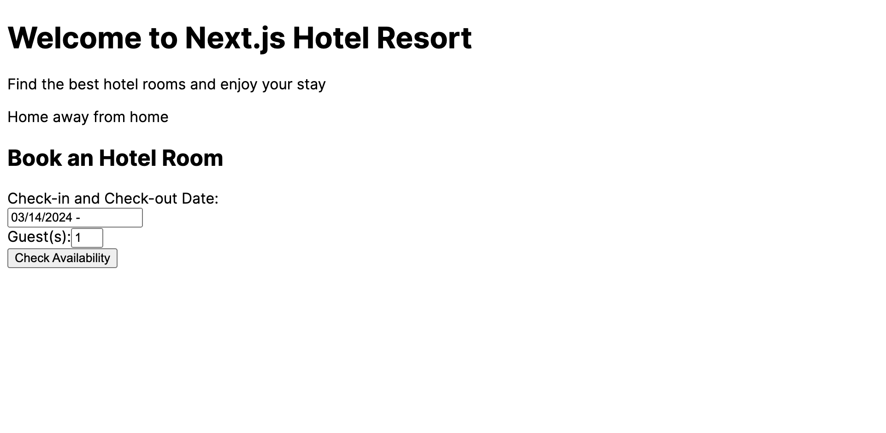
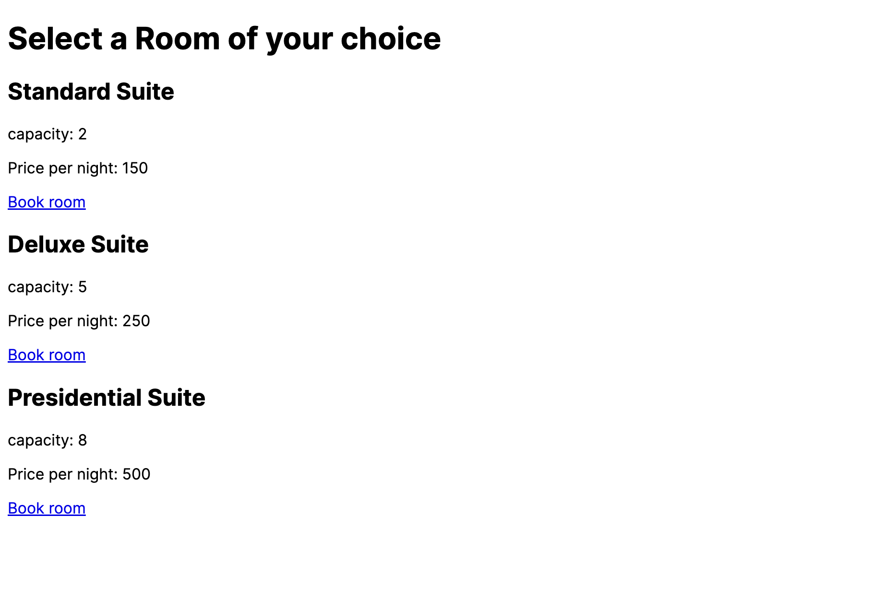
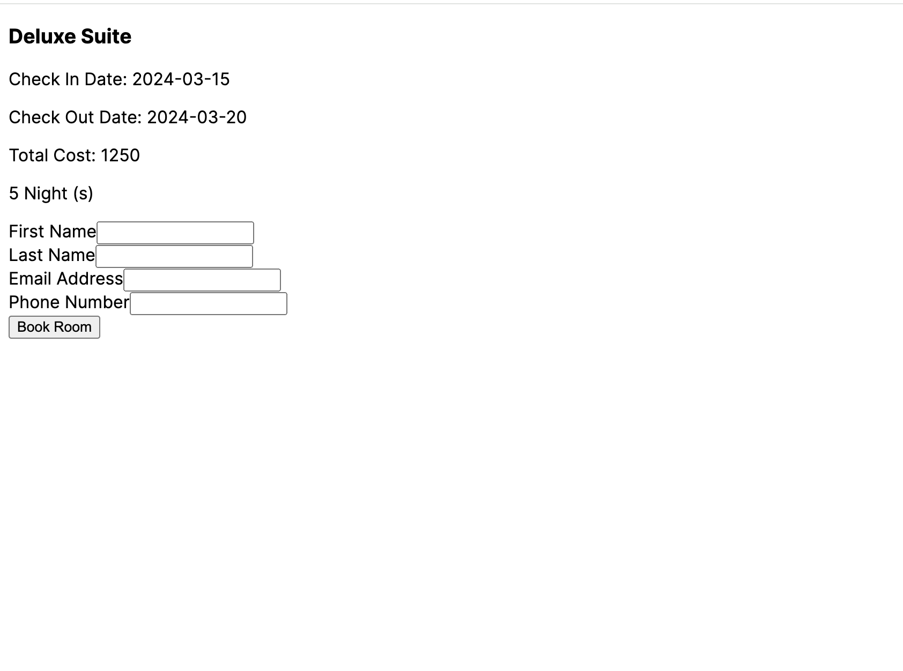

## Introduction

A Hotel booking website is a web platform that enables users to book hotel rooms of their choice based on the availability of rooms. In this tutorial, you will build a fully functional hotel booking website, using Next.js for the frontend, Directus as the backend service and Stripe for receiving payments. You will create different room types, create and store rooms based on the room types, create new reservations dynamically when a room payment is successful and block the availability for that room based on the check-in and check-out date for the reservation.

## Before You Start

You will need:

- [Node.js](https://nodejs.org/) installed and a code editor on your computer.
- A Directus project - you can use [Directus Cloud](https://directus.cloud/) or [run it yourself](https://docs.directus.io/self-hosted/quickstart.html).
- A [Stripe](https://stripe.com/) account with a business already set up
- [Stripe CLI](https://docs.stripe.com/stripe-cli) installed in your computer
- Some knowledge of TypeScript and React.

<!-- ## Your Sections Here -->

## Set Up Directus

### Data Model Relationships

Before setting up Directus, let's understand how the different data models you will set up in Directus are related.

You need 3 data models, `room_Types`, `rooms`, `reservations`



- `room_types` are the hotel's different types of rooms and can have multiple `rooms`.
- `rooms` are all the rooms the hotel has. A single room can only be of one `room_types` and can contain multiple reservations.
- `reservations` are all the reservations made by users from the application's frontend after successfully making a payment.

In your Directus project, head to Settings -> Data Model  to create these data models with the following fields:

- The collection Room Types (`room_types`) should have the following fields:
  - `id`: the primary field of this collection
  - `name`: A string field for a room type
  - `capacity`: An integer input field for the maximum number of guests a room can occupy.
  - `price`: A string input price of a room
  - `rooms`: A `One to Many` relational field related to the `rooms` collection, signifying that a single room type can have multiple rooms.

- The collection Rooms (`rooms`) should have the following fields:
  - `id`: the primary field of this collection
  - `is_available`: A toggle field for a room that indicates whether it is available for booking.
  - `capacity`: An integer input field for the maximum number of guests a room can occupy.
  - `room_number`: A string input to label a room
  - `room_type`: A `Many to One` relational field related to the `room_types` collection, signifying that multiple rooms can only have a single room type.
  - `reservations`: A `One to Many` relational field that is related to the `reservations` collection, signifying that a single room can have multiple reservations

- The collection Reservations (`reservations`) should have the following fields:
  - `id`: the primary field of this collection
  - `first_name`: A string input for the first name
  - `last_name`: A string input for the last name
  - `email`: A string input for email address
  - `phone_number`: A string input for phone number
  - `check_in_date`: A Datetime input for the check-in date for the reservation
  - `check_out_date`: A Datetime input for the check-out date for the reservation
  - `room_id`: A `Many to One` relational field that is related to the `rooms` collection, signifying that a single room can have multiple reservations
  - `nights`: A string input for the number of nights the reservations will last.
  - `total_price`: A string input for the total cost of the reservation
  - `payment_id`: A string input for the payment for the reservation that happened on Stripe.

Create some items in the Room Types and Rooms collections - [here's some sample data](https://github.com/codejagaban/nextjs-hotel-booking/tree/main/sample-data).

### Configure the Directus SDK

1. Open the `hotel-resort` project in a code editor and create a `.env.local` with the content:

    ```bash
    DIRECTUS_URL=YOUR_DIRECTUS_URL
    APP_URL=http://localhost:3000
    ```

2. Create a new directory called `lib`. Inside it, create `directus.ts` with the following content to initialize a new Directus SDK instance:

```ts
import { createDirectus, rest } from "@directus/sdk";

//data Schema for Directus
type RoomTypes = {
  capacity: number;
  price: string;
  name: string;
  rooms: number[];
};

type Reservations = {
  first_name: string;
  last_name: string;
  email: string;
  phone_number: string;
  check_in_date: string;
  check_out_date: string;
  room_id: string;
  nights: number;
  total_price: string;
  payment_id: string
};

type Schema = {
  room_types: RoomTypes[];
  reservations: Reservations[];
};
const directus = createDirectus<Schema>(
  process.env.DIRECTUS_URL as string
).with(rest());

export default directus;
```

### Create Directus API Actions

In the `lib` directory, create a new file called `apis.ts`. This file will contain all the API requests the Next.js application will make to Directus.

Add a `getRoomTypes` function to the file:

`lib/apis.ts`

```tsx
import directus from "./directus";
import { readItems, createItem } from "@directus/sdk";

export const getRoomTypes = async (
  checkInDate: string,
  checkOutDate: string,
  capacity: string
) => {
  try {
    const availableRooms = await directus.request(
      readItems("room_types", {
        // fetches all fields from room_types
        fields: ["*"],
        filter: {
          // check if the capacity is greater than the requested capacity
          capacity: { _gte: Number(capacity) },
        },
        deep: {
          rooms: {
            _limit: 1,
            _filter: {
              _or: [
                // check if the room is available and if the check_in_date is empty
                {
                  _and: [
                    {
                      is_available: true,
                      reservations: {
                        check_in_date: { _null: true },
                      },
                    },
                  ],
                },
                // check if the room is available and if the check_out_date is empty
                {
                  _and: [
                    {
                      is_available: true,
                      reservations: {
                        check_out_date: { _null: true },
                      },
                    },
                  ],
                },
                // check if the check_out_date is less than the requested checkInDate
                {
                  _and: [
                    {
                      is_available: true,
                      reservations: {
                        check_out_date: { _lt: checkInDate },
                      },
                    },
                  ],
                },
                // check if the check_in_date is less than the requested checkOutDate
                {
                  _and: [
                    {
                      is_available: true,
                      reservations: {
                        check_in_date: { _gt: checkOutDate },
                      },
                    },
                  ],
                },
              ],
            },
          },
        },
      })
    );
    console.log(availableRooms);
    return availableRooms;
  } catch (error) {
    console.error("Error fetching available room types:", error);
    // Handle the error as needed
    console.log(error);
  }
};
```

Let's break down the `getRoomTypes` object for better understanding:

- The `filter` field uses a filter operator to filter the `room_types` collection only to show the room types whose capacity is `_gte` (greater than or equal to) the requested `capacity`.
- Next, we use a `deep` parameter to filter the nested relational dataset in the `room_types` collection
In the `deep` parameter, we use Directus's logic operators `_or` and `_and` to check if any rooms are available and if their reservation date does not conflict with the requested data dates.
- If the `reservations` `check_in_date` and `check_out_date` dates are null, it means the room has never been booked before; thus, it is available. If the `check_in_date` of the room is `_gt`( greater than ) the `checkOutDate`, it means the room is also available, so also if the `check_out_date` is `_lt` (lesser than) the `checkInDate`.

- Using the `_limit` parameter, we are limiting the `rooms` result to be just one as we only need users to book one room when making a reservation
Finally, based on Directus's response, the `getRoomTypes` function will either throw an error or return the fetched `roomTypes`.

Also, Still inside the `lib/apis.ts` file, create a another function for making a new reservation called `makeReservation` with the code snippet:

```ts
type ReservationData = {
  first_name: string;
  last_name: string;
  email: string;
  phone_number: string;
  check_in_date: string;
  check_out_date: string;
  room_id: string;
  nights: string;
  total_price: string;
  payment_id: string;
};

export const makeReservation = async (reservationData: ReservationData) => {
  try {
    const data = await directus.request(
      createItem("reservations", {
        ...reservationData,
      })
    );
    return "Booking Successful";
  } catch (error) {
    console.error("Error creating a reservation:", error);
    // Handle the error as needed
    console.log(error);
  }
};
```

The `makeReservation` function, sends a request to Directus to create a new reservation with a `reservationData` object.

## Setting Up a Next.js Application

Run the following command to initialize a Next.js project:

```bash
npx create-next-app@14 hotel-resort
```

During installation, when prompted, choose the following configurations:

```bash
✔ Would you like to use TypeScript?  Yes
✔ Would you like to use ESLint?  Yes
✔ Would you like to use Tailwind CSS? No
✔ Would you like to use `src/` directory?  No
✔ Would you like to use App Router? (recommended)  Yes
✔ Would you like to customize the default import alias (@/*)? Yes
✔ What import alias would you like configured? @/*
```

Install the required dependencies:

```bash
npm i @directus/sdk dayjs react-datepicker @stripe/stripe-js
```

## Set Up The Homepage With Date Picker

In the `app` directory, create a `form.tsx` file with the content:

```tsx
"use client";
import { useState, FormEvent } from "react";
import { useRouter } from "next/navigation";
import DatePicker from "react-datepicker";
import "react-datepicker/dist/react-datepicker.css";

type DateState = Date | null;
export default function BookingForm() {
  const [startDate, setStartDate] = useState<DateState>(new Date());
  const [endDate, setEndDate] = useState<DateState>();
  const router = useRouter();
  const [error, setError] = useState("");

  const handleChange = (range: DateState[]) => {
    const [startDate, endDate] = range;
    setStartDate(startDate);
    setEndDate(endDate);
  };

  const handleFormSubmit = (e: FormEvent<HTMLFormElement>) => {
    const formData = new FormData(e.currentTarget);
    e.preventDefault()
    if (!endDate) {
    setError("Please add a check out date")
    } else {
      const checkAvailabilityData = {
        checkInDate: startDate,
        checkOutDate: endDate,
        capacity: formData.get("capacity")
      }
      router.push(`/bookings/rooms?checkInDate=${checkAvailabilityData.checkInDate}&checkOutDate=${checkAvailabilityData.checkOutDate}&capacity=${checkAvailabilityData.capacity}`)
    }
  }

  <input type="number" name="capacity" />;
  return (
    <form onSubmit={handleFormSubmit}>
      <div>
        <h2>Book an Hotel Room</h2>
        <div>
          <div>
            <label htmlFor="checkInDate"> Check-in and Check-out Date:</label>
            {error && <span>{ error }</span>}
            <DatePicker
              selected={startDate}
              onChange={handleChange}
              startDate={startDate}
              endDate={endDate}
              selectsRange
              withPortal
              required
            />
          </div>
          <div>
            <label htmlFor="capacity"> Guest(s):</label>
            <input
              type="number"
              name="capacity"
              defaultValue={1}
              min={1}
              max={6}
            />
          </div>
        </div>

        <button type="submit">Check Availability </button>
      </div>
    </form>
  );
}
```

The code snippet above:

- Uses the `DatePicker` component to render a date picker form for users to submit the selected range of their check-in and check-out periods.
- The form also contains an input of the number of guests the user will be bringing
- gather the data from the form and, when submitted, push the data as query parameters using the Next.js `router.push` method to the `/bookings/rooms` URL.

To display this form, in the `app/page.tsx` file, replace the content with:

```tsx
import BookingForm from "./form";

export default function Home() {

  return (
    <main>
      <div>
        <h1>Welcome to Next.js Hotel Resort</h1>
        <p>Find the best hotel rooms and enjoy your stay</p>
        <p>Home away from home</p>
        <BookingForm />
      </div>
    </main>
  );
}
```

You should have a UI with the form displayed that looks like this:


## Create a Rooms Page to Display Room Types Based on Available Rooms

Inside the `app` directory, create a new directory called `bookings`; inside it, create another directory called `rooms`.  This route will be responsible for displaying the list of room types based on the availability of the rooms.

Inside of the `rooms` directory, create a `page.tsx` file and update its content:

```tsx
import { getRoomTypes } from "@/lib/apis";
import dayjs from "dayjs";
import Link from "next/link";

export default async function Rooms({
  searchParams,
}: {
  searchParams: { [key: string]: string };
}) {
  console.log(searchParams);
  const { capacity, checkInDate, checkOutDate } = searchParams;

  const formattedCheckInDate = dayjs(checkInDate).format("YYYY-MM-DD");
  const formattedCheckOutDate = dayjs(checkOutDate).format("YYYY-MM-DD");
  const roomTypes = await getRoomTypes(
    formattedCheckInDate,
    formattedCheckOutDate,
    capacity
  );

  return (
    <main>
      <div>
        <h1>Select a Room of your choice</h1>
        <div>
          {roomTypes &&
            roomTypes.map((roomType) => {
              return (
                <div key={roomType.id}>
                  <h2>{roomType.name}</h2>
                  <p>capacity: {roomType.capacity}</p>
                  <p>Price per night: {roomType.price}</p>
                  {roomType.rooms.length > 0 ? (
                    <Link
                      href={`/bookings/checkout?checkInDate=${formattedCheckInDate}&checkOutDate=${formattedCheckOutDate}&room=${roomType.rooms[0]}&price=${roomType.price}&roomType=${roomType.name}`}
                    >
                      Book room
                    </Link>
                  ) : (
                    "Room unavailable"
                  )}
                </div>
              );
            })}
        </div>
      </div>
    </main>
  );
}
```

The code above:

- Gets the inputs from the previous page via `searchParams` and fires up the `getRoomTypes` function.

- Displays the available room types fetched from the `getRoomTypes` function and displays in HTML
- It also checks the `roomTypes.rooms` array to determine if a room is available and displays a link to book that room. If there's an available room, it renders a link to the booking form that room. Otherwise, it renders an `Room unavailable` text.

You should have UI on the browser that looks like this:


## Set up Stripe for Receiving Payments

To set up Stripe for receiving payments on your Next.js application,

Update your `.env.local` file with the publishable and secret keys you copied:

```bash
NEXT_PUBLIC_STRIPE_PUBLISHABLE_KEY=YOUR_STRIPE_PUBLISHABLE_KEY
STRIPE_SECRET_KEY=YOUR_STRIPE_SECRET_KEY
```

Next, create a Next.js API URL to handle the stripe payment logic.

To do this, go to your `app` directory, create a new directory called `api` and inside of it, create a directory `stripe-session` with a `route.ts` file that has the content:

`app/api/stripe-session/route.ts`

```ts
import { NextResponse } from "next/server";
import Stripe from "stripe";

const stripe = new Stripe(process.env.STRIPE_SECRET_KEY as string);
type RequestData = {
  first_name: string,
  last_name: string,
  email: string,
  phone_number: string,
  check_in_date: string,
  check_out_date: string,
  room_id: string,
  nights: number,
  total_price: string,
  roomType: string,
  price: number;
};
export async function POST(req: Request) {
  const {
    price,
    roomType,
    room_id,
    nights,
    check_in_date,
    check_out_date,
    first_name,
    last_name,
    phone_number,
    email,
  }: RequestData = await req.json();
  const totalPrice = price * 100;
  try {
    // Create Checkout Session
    const stripeSession = await stripe.checkout.sessions.create({
      line_items: [
        {
          quantity: 1,
          price_data: {
            currency: "usd",
            product_data: {
              name: roomType,
              description: `Payment for ${nights} Night(s)`
            },
            unit_amount: totalPrice,
          },
        },
      ],
      mode: "payment",
      success_url: `${process.env.APP_URL}/bookings/success`,
      cancel_url: `${process.env.APP_URL}/bookings/checkout?checkInDate=${check_in_date}&checkOutDate=${check_out_date}&roomType=${roomType}&price=${price/nights}&room=${room_id}`,
      metadata: {
        nights,
        total_price: totalPrice,
        room_id,
        check_in_date,
        check_out_date,
        first_name,
        last_name,
        phone_number,
        email,
      },
    });
    console.log(stripeSession);
    return NextResponse.json({ url: stripeSession.url! });
  } catch (err) {
    console.log({ err });
    return NextResponse.json(
      { message: "An expected error occurred, please try again" },
      { status: 500 }
    );
  }
}
```

The above code does the following:

- Creates a Next.js API that expects a request  booking information to create a new booking/reservation,
- Creates a new Stripe session with the `stripe.checkout.sessions.create` method from the Stripe SDK.
- Adds the required data to create payment details for a Stripe product, such as a `name`, `description` and `unit_amount`.
- Specify `payment` as the Stripe `mode` of payment.
- Provide a `success_url` and `cancel_url` URL to redirect the user to determine if the payment was successful or cancelled.
- Attaches a `metadata` object to save the user details to the stripe payment payload when the payment is initiated.
- Returns the Stripe payment session URL so the user can make the payment if the request is successful.

You will use this API route in the next section of this tutorial.

## Create a Checkout Page for Available Rooms

With an available room selected, you need to create a checkout page, get details, and pay for the available room. To do this, create a new directory in the `app/bookings` called `checkout`. Inside of it, make a `roomWidget.tsx` with the code snippet:

`app/bookings/checkout/roomWidget.tsx`

```tsx

type RoomType = {
  roomType: string,
  checkInDate: string,
  checkOutDate: string,
  nights: number,
  totalPrice: number
}
export default function RoomWidget({
  roomType,
  checkInDate,
  checkOutDate,
  nights,
  totalPrice,
}: RoomType) {
  return (
    <div>
      <h3>{roomType}</h3>
      <p>Check In Date: <span>{checkInDate}</span></p>
      <p>Check Out Date: <span>{checkOutDate}</span></p>
      <p>Total Cost: {totalPrice}</p>
      <p>{ nights } Night (s)</p>
    </div>
  )
}
```

This widget component will display a summary of the selected room on the checkout page.

Next, create a `form.tsx` file to gather details from the user input with the content:

```tsx
"use client";
import { loadStripe } from "@stripe/stripe-js";
import { FormEvent, useEffect } from "react";

type RoomType = {
  roomID: string;
  nights: number;
  checkInDate: string;
  checkOutDate: string;
  price: number;
  roomType: string,
};

export default function BookingForm({
  roomID,
  nights,
  price,
  checkInDate,
  checkOutDate,
  roomType
}: RoomType) {
  useEffect(() => {
    loadStripe(process.env.NEXT_PUBLIC_STRIPE_PUBLISHABLE_KEY!);
  }, []);

  const handleFormSubmit = async (e: FormEvent<HTMLFormElement>) => {
    e.preventDefault();
    const formData = new FormData(e.currentTarget);
    const bookingData = {
      check_in_date: checkInDate,
      check_out_date: checkOutDate,
      nights,
      room_id: roomID,
      price,
      roomType,
      first_name: formData.get("firstName") as string,
      last_name: formData.get("lastName") as string,
      email: formData.get("email") as string,
      phone_number: formData.get("phoneNumber") as string,
    };
    try {
      console.log({bookingData})
      const response = await fetch("/api/stripe-session", {
        method: "POST",
        body: JSON.stringify(bookingData),
      });

      if (response.ok) {
        const payment = await response.json();
        window.location.href = payment.url;
      } else {
        console.error("Error submitting form:", response.statusText);
      }
    } catch (error) {
      console.error("Error:", error);
    }
  };
  return (
    <form onSubmit={handleFormSubmit}>
      <div>
        <label htmlFor="firstName">First Name</label>
        <input type="text" name="firstName" id="firstName" required />
      </div>
      <div>
        <label htmlFor="lastName">Last Name</label>
        <input type="text" name="lastName" id="lastName" required />
      </div>
      <div>
        <label htmlFor="email">Email Address</label>
        <input type="email" name="email" id="email" required />
      </div>
      <div>
        <label htmlFor="phoneNumber">Phone Number</label>
        <input type="text" name="phoneNumber" id="phoneNumber" required />
      </div>
      <div>
        <button type="submit">Book Room</button>
      </div>
    </form>
  );
}
```

The `BookingForm` components:

- Loads the Stripe SDK when the component is mounted using the `loadStripe` function.
- Creates a form that gets the user details such as `firstName`, `lastName`, `email` and `phoneNumber`
- Receives room details for booking a room as `props`
- Creates a new `bookingData` object, combining the selected room details and the user-filled form data.
- When the form is submitted, it fires up a request to the `/api/stripe-session` route you created in the previous step to trigger a payment from Stripe.
- When the request is successful, it redirects the user to the Stripe payment link returned from the Stripe API route.

To render this form in the same directory, create a new file called `page.tsx` with the content:

```tsx
import dayjs from "dayjs";
import BookingForm from "./form";
import RoomWidget from "./roomWidget";


export default async function Bookings({
  searchParams,
}: {
  searchParams: { [key: string]: string };
}) {
  const { checkInDate, checkOutDate, room, price, roomType } = searchParams;
  // Calculate the number of nights
  const nights = dayjs(checkOutDate).diff(checkInDate, "day");
  const totalPrice = nights * Number(price);
  return (
    <main>
      <div>
        <RoomWidget
          roomType={roomType}
          checkInDate={checkInDate}
          checkOutDate={checkOutDate}
          totalPrice={totalPrice}
          nights={nights}
        />
        <BookingForm
          roomID={room}
          nights={nights}
          price={totalPrice}
          checkInDate={checkInDate}
          checkOutDate={checkOutDate}
          roomType={roomType}
        />
      </div>
    </main>
  );
}
```

This should provide you with a checkout page that looks like this:


Clicking on the `Book Room` button to submit the form will trigger a Stripe payment and take you to a Stripe page that looks like this:


This form will trigger a stripe payment to pay for the selected room.

Next, create a `success` directory in the `app/bookings` directory to create a success page when payment is successfully made.

In the `success` directory, create a `page.tsx` that has the content:

```tsx
"use client";

import Link from "next/link";

export default function SuccessPage() {
  return (
    <div>
      <h1>Hotel Booking Payment Successful!</h1>
      <p>You will receive an email with your booking details</p>
      <Link href="/"
      >
        Go back to Homepage
      </Link>
    </div>
  );
}
```

This page should look like this in the browser:


## Configure A Webhook to Listen for Stripe Payment Events

When a Stripe payment is resolved successfully, we want to send Directus a request to create a new reservation using the `metadata` we stored in the payment request.

To do this, Stripe has a list of events that we can listen to when a payment is triggered. Let's create a webhook in Next.js that can listen to a Stripe event when a payment goes through.

In your `app/api/` directory, create a new directory with a subdirectory called `webhook/stripe,` and inside of this directory, create a `route.ts` for implementing a webhook,
Add the following code snippet to `route.ts`:

```ts
import { NextResponse } from "next/server";
import Stripe from "stripe";
import { makeReservation } from "@/lib/apis";

const checkout_session_completed = "checkout.session.completed";
const stripe = new Stripe(process.env.STRIPE_SECRET_KEY as string);

export async function POST(req: Request, res: Response) {
  const reqBody = await req.text();
  const sig = req.headers.get("stripe-signature");
  const webhookSecret = process.env.STRIPE_WEBHOOK_SECRET;

  let event: Stripe.Event;

  try {
    if (!sig || !webhookSecret) return;
    event = stripe.webhooks.constructEvent(reqBody, sig, webhookSecret);
  } catch (error: any) {
    console.log(error);
    return NextResponse.json(
      { message: `Webhook Error: ${error.message}` },
      { status: 500 }
    );
  }

  // load our event
  switch (event.type) {
    case checkout_session_completed:
      const session = event.data.object;
      if (!session.metadata || !session.payment_intent) {
        console.error("Missing metadata or Payment Intent in Stripe session");
        // Optionally return an error response
        return NextResponse.json(
          { message: "Incomplete reservation data" },
          { status: 400 }
        );
      }

      const {
        // @ts-ignore
        metadata: {
          first_name,
          last_name,
          email,
          phone_number,
          check_in_date,
          check_out_date,
          room_id,
          nights,
          total_price,
        },
        payment_intent,
      } = session;
      console.log({ payment_intent });
      await makeReservation({
        first_name,
        last_name,
        email,
        phone_number,
        check_in_date,
        check_out_date,
        room_id,
        nights,
        total_price,
        payment_id: payment_intent as string,
      });

      return NextResponse.json("Booking successful", {
        status: 200,
        statusText: "Booking Successful",
      });

    default:
      console.log(`Unhandled event type ${event.type}`);
  }

  return NextResponse.json({ message: "Event Received" }, { status: 200 });
}
```

Let's break down the webhook route handler for better understanding:

- First, you initialize a new Stripe instance using a `STRIPE_SECRET_KEY`.
- Next, we use the request body as the "stripe-signature" header and `STRIPE_WEBHOOK_SECRET` to check the authenticity of the request and create the Stripe event.
- We then use a switch statement to listen for the Stripe event where the `event.type` is `checkout.session.completed` (This means the payment checkout went through successfully in Stripe)
- Next, you extract the `metadata` and `payment_intent` from the session that the `event.data.object` provides.
- Using the data extracted from the `metadata,` the webhook requests Directus to create a new reservation.

### Testing the Webhook

With Stripe CLI installed on your computer, run the command:

```bash
stripe login
```

Next, let's forward the API route handle in the Next.js application to Stripe to listen for it with the command:

```bash
stripe listen --forward-to localhost:3000/api/webhook/stripe
```

This will provide you with a response like:

```bash
> Ready! You are using Stripe API Version [2022-08-01]. Your webhook signing secret is whsec_f9e4axxxxxxx (^C to quit)
```

Copy your webhook signing secret, as this is needed to verify and trigger an event from the webhook.

After that, open a new terminal tab and test the webhook by triggering a Stripe event from the CLI with:

```bash
stripe trigger payment_intent.succeeded
```

You will receive a response that looks like this:


## Summary

That's a wrap! In this tutorial, you've successfully created a hotel booking website fetching data from Directus and its relational datasets using Directus's powerful operators and filter rules, trigger a payment on Stripe, create a webhook that listens to the Stripe payment, and then make a reservation in Directus.

This tutorial provides a good example of how to set up complex relational datasets and carry out complex [filter operations](https://docs.directus.io/reference/filter-rules.html) in Directus.

The complete code for this tutorial can be found [here](https://github.com/codejagaban/nextjs-hotel-booking).

Some possible steps to carry out next might include:

- **User Authentication:** Consider adding user authentication so users can sign up, log in, and manage their bookings. This adds a layer of security and personalization to the application.

- **Admin Dashboard:** Create an admin dashboard where hotel staff can manage room availability, view reservations, and update booking details. This can be achieved by implementing user roles and permissions in Directus.
- **Email Notifications:** Set up email notifications to confirm bookings, send reminders, and provide updates on reservation status. This can also be implemented in Directus using [Directus flows](https://docs.directus.io/app/flows.html).
- **Reviews and Ratings:** Add a feature for users to leave reviews and ratings for booked rooms. This can help future guests make informed decisions and provide valuable feedback to the hotel.
- **Proper Error Handling:** Consider handling errors properly and displaying the errors in the UI, such as error form fields were not filled, payment was unsuccessful, or an error occurred.
- **Styling the Application:** The project is made with HTML. To make it, consider styling the application with CSS or a CSS framework of your choice, like TailwindCSS.
